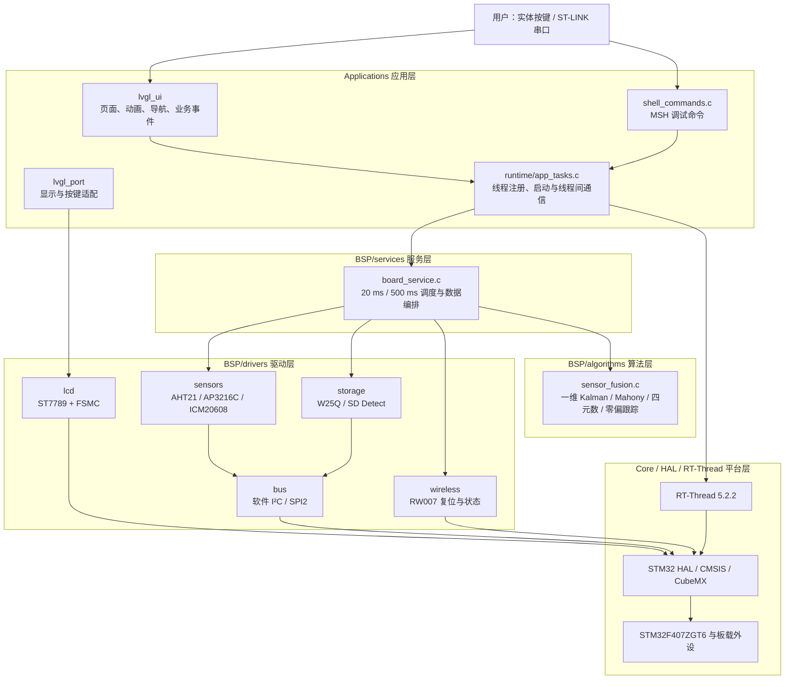
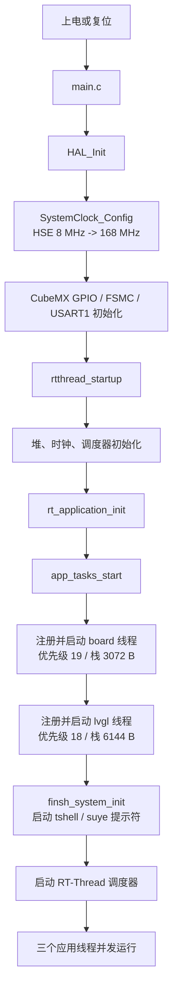
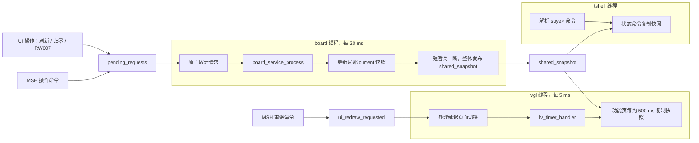
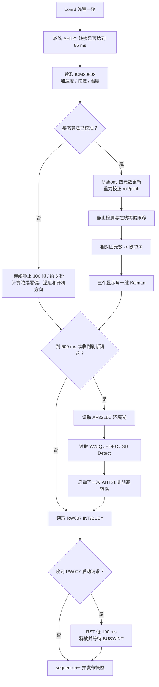
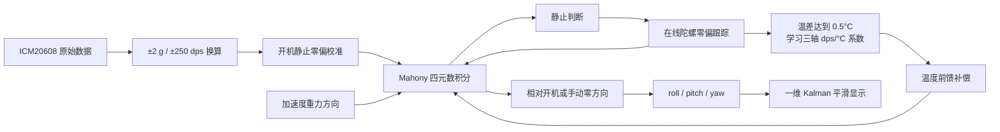
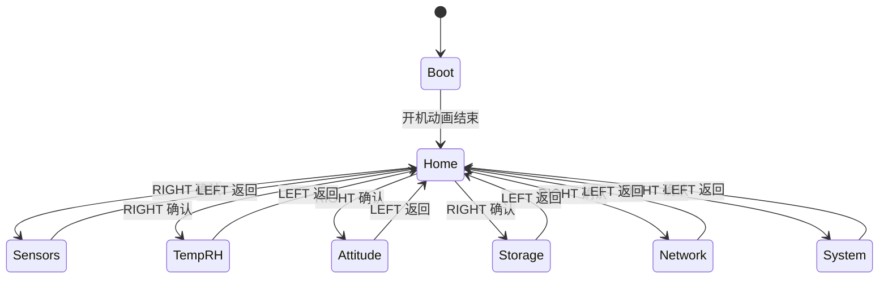
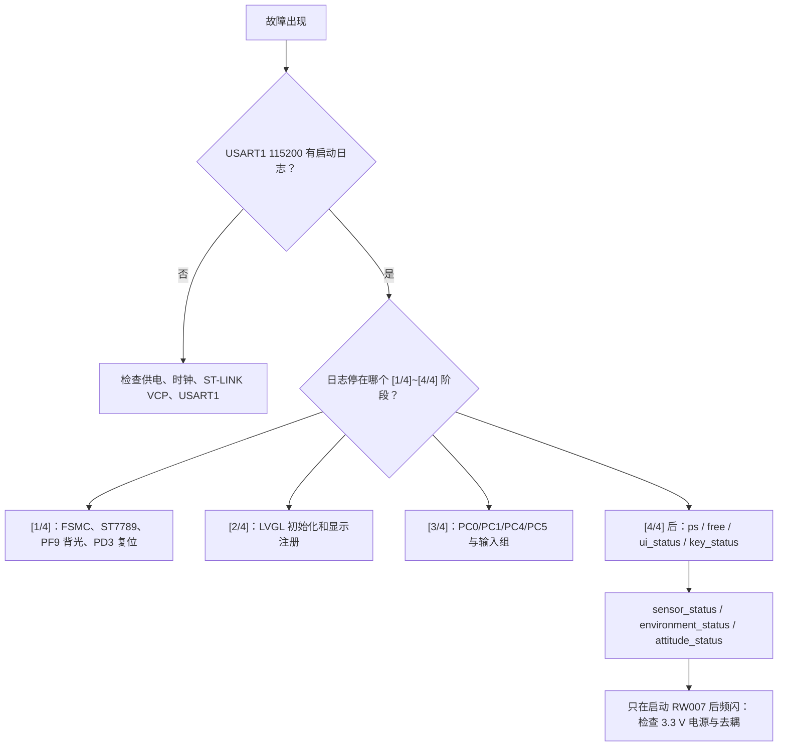

# STM32F407 RT-Thread + LVGL 软件架构与逻辑框图

本文用于二次开发、学习和故障定位。它说明工程各层的职责、线程如何启动、
数据如何在线程之间传递，以及增加新驱动或新 UI 功能时应修改哪些文件。

## 1. 总体分层



分层原则：

- UI 不读写 GPIO、I²C 或 SPI，只读取状态快照、提交异步请求。
- `app_tasks.c` 是线程注册、线程启动、共享快照和请求标志的唯一管理点。
- `board_service.c` 组合驱动和算法，但不创建 RT-Thread 线程。
- 每个驱动只处理自己的引脚、寄存器、时序和物理量换算。
- 算法层不访问 HAL、RT-Thread、LVGL，方便移植和离线测试。

## 2. 目录和文件职责

```text
Applications/
├─ app_init.c                      RT-Thread 应用启动钩子
├─ runtime/
│  ├─ app_tasks.c                  所有线程、栈、优先级和线程间通信
│  └─ app_tasks.h                  UI/MSH 可调用的安全通信接口
├─ lvgl_port/
│  ├─ lv_port_disp.c               LVGL flush 到 ST7789
│  └─ lv_port_indev.c              四方向键到 LVGL keypad/group
├─ lvgl_ui/
│  ├─ ui_boot_screen.c             非阻塞开机动画
│  ├─ ui_main_menu.c               六功能主页
│  ├─ ui_feature_pages.c           六个功能页及快照显示
│  └─ ui_navigation.c              延迟切屏、确认和返回
├─ shell_commands.c                FinSH/MSH 自定义命令
└─ serial_console_ui.c             suye 串口 Logo 和帮助

BSP/
├─ services/board_service.c        高频/慢速采集和算法编排
├─ algorithms/sensor_fusion.c      Kalman、Mahony、四元数和零漂抑制
├─ drivers/
│  ├─ bus/soft_i2c.c               PE/PF 软件 I²C 公共位操作
│  ├─ bus/spi2_board.c             SPI2 和共享片选/状态管脚
│  ├─ sensors/aht21.c              非阻塞温湿度转换
│  ├─ sensors/ap3216c.c            环境光；当前关闭 PS/IR
│  ├─ sensors/icm20608.c           加速度、角速度、芯片温度
│  ├─ storage/board_storage.c      W25Q JEDEC 和 SD 插卡检测
│  └─ wireless/rw007_hw.c          RW007 复位、启动等待和状态读取
├─ lcd/st7789_fsmc.c               LCD 控制器和 FSMC 写像素
├─ rt_hw_console.c                 USART1 115200 控制台
└─ rtthread_startup.c              RT-Thread 内核启动
```

## 3. 系统启动逻辑框图



注意：RT-Thread 的优先级数字越小，优先级越高。GUI 使用 18，board 使用 19，
FinSH 默认约为 20，使短时间 LCD 刷新优先完成。线程循环都主动休眠，不会忙等占满 CPU。

## 4. 线程与通信逻辑框图



跨线程规则：

1. board 线程始终先更新局部 `current`，不直接逐字段修改共享快照。
2. 发布和复制快照只在很短的关中断区内完成，不包含 I²C、SPI 或浮点计算。
3. UI 和 MSH 只置请求标志，不等待耗时外设操作完成。
4. 所有 `lv_*` API 只能由 lvgl 线程调用。
5. 姿态校准完成前收到的“设为正方向”请求会保留，校准完成后自动执行。

公共通信接口位于 `Applications/runtime/app_tasks.h`：

| 接口 | 用途 | 调用者 |
|---|---|---|
| `app_tasks_start()` | 创建 board、lvgl、tshell | `app_init.c` |
| `app_tasks_get_board_snapshot()` | 原子复制板载状态 | UI、MSH |
| `app_tasks_request_board_refresh()` | 请求慢速设备立即更新 | UI、MSH |
| `app_tasks_request_rw007_reset()` | 请求复位并启动 RW007 | UI、MSH |
| `app_tasks_request_attitude_zero()` | 请求把当前方向设为正方向 | UI、MSH |
| `app_tasks_request_ui_redraw()` | 请求 GUI 下一轮整页重绘 | MSH |

## 5. 板载采集与算法逻辑框图



采样周期：

| 路径 | 周期 | 说明 |
|---|---:|---|
| ICM20608 与姿态融合 | 20 ms，约 50 Hz | 使用实际 RT-Thread tick 计算 `dt` |
| AHT21 转换轮询 | 每轮检查 | 转换需约 85 ms，但不阻塞线程等待 |
| AP3216C、W25Q、SD | 500 ms | 也可由 UI/MSH 请求立即刷新 |
| UI 状态文本 | 约 500 ms | 只读快照，不访问硬件 |
| LVGL 主循环 | 5 ms | 按键、动画、重绘和 flush |

## 6. 姿态算法和零漂处理



- ICM20608 没有磁力计，yaw 只有相对方向，没有绝对地磁参考。
- 重力可以长期约束 roll/pitch，但不能从物理上消除 yaw 长期漂移。
- 开机校准和按下 SET ZERO 时应保持开发板静止。
- 开机使用 300 帧平均；在线零偏跟踪只在加速度接近 1 g、角速度很小并持续静止时启用。
- UI 与串口只显示 corrected 补偿值；原始角速度仅在算法内部参与计算，不进入公共快照。
- 需要绝对航向时，应增加磁力计或外部航向参考并升级到九轴融合。

## 7. UI 和实体按键逻辑框图



按键映射：

| 实体键 | LVGL 键值 | 功能 |
|---|---|---|
| UP | `LV_KEY_PREV` | 上一个可聚焦控件 |
| DOWN | `LV_KEY_NEXT` | 下一个可聚焦控件 |
| RIGHT | `LV_KEY_ENTER` | 确认、进入页面、执行按钮 |
| LEFT | `LV_KEY_ESC` | 返回主页 |

页面切换不在按键回调中立即删除当前 screen。回调只提交导航请求，
`ui_navigation_process()` 在下一轮 GUI 循环中创建新页面、切屏并删除旧页面，
避免确认/返回过程中访问已经释放的 LVGL 对象。

## 8. 防频闪相关逻辑

当前实机稳定策略必须在二次开发时保留：

- ST7789 使用局部刷新，不周期性执行整屏清空或重新初始化。
- AP3216C 只启用 ALS，关闭会产生脉冲电流的 PS/IR 发射。
- RW007 开机保持 `RST=low`，只在 Network 页面或 MSH 命令明确请求时启动。
- 不在 GUI 线程执行 AHT21 的 85 ms 转换等待、RW007 复位等待或 SPI 探测。
- 如果 RW007 启动后仍频闪，应优先检查 3.3 V 电源、地线和模块附近去耦。

## 9. 增加新外设的标准步骤

以增加一个新的 I²C 传感器为例：

1. 在 `BSP/drivers/sensors/` 新建 `new_sensor.c/.h`。
2. 驱动头文件只公开初始化、读取以及必要的数据结构。
3. 驱动使用 `soft_i2c_*`，不要调用 LVGL，也不要创建线程。
4. 在 `board_service_snapshot_t` 增加 UI 所需的稳定数据字段。
5. 在 `board_service_init()` 初始化设备。
6. 在 `board_service_process()` 的高频或慢速路径调用驱动。
7. 在 `app_tasks.h` 增加请求接口；请求标志仍只放在 `app_tasks.c`。
8. UI 通过快照显示结果，按键回调只提交请求。
9. 将新 `.c` 加入 `CMakeLists.txt`，完整编译后再烧录。

禁止把以下内容混在新驱动中：

- `rt_thread_init()` 或 `rt_thread_startup()`；
- `lv_label_set_text()` 等 LVGL 调用；
- 页面编号、焦点组或串口命令解析；
- 与该器件无关的其他传感器寄存器。

## 10. 移植时替换范围

| 需求 | 主要修改 | 尽量保持不变 |
|---|---|---|
| 更换同类传感器 | 对应 `BSP/drivers/sensors/` 和服务编排 | UI、线程通信、其他驱动 |
| 更换 LCD | `BSP/lcd/`、必要时 `lv_port_disp.c` | 页面业务、传感器服务 |
| 换成触摸或编码器 | `lv_port_indev.c` | 页面和导航接口 |
| 更换 STM32 板卡 | CubeMX/Core、总线和 GPIO 驱动 | 算法、快照接口、UI |
| 更换 RTOS | `app_tasks.c`、tick/临界区接口 | 驱动寄存器逻辑、算法、UI结构 |
| 接入 RT-Thread Sensor/FAL/WLAN | 驱动和 `board_service.c` | `app_tasks_*` 和快照消费者 |

移植的核心是保持两个边界稳定：

1. UI/MSH 面向 `app_tasks_*`，不面向具体硬件。
2. `board_service_snapshot_t` 作为显示与诊断的数据协议尽量保持兼容。

## 11. 调试定位顺序



建议首先阅读 `Applications/runtime/app_tasks.c`，它能看到整个系统的线程和数据流；
随后阅读 `BSP/services/board_service.c`，再进入需要修改的具体驱动。这样学习和排错
都不必从 500 多个 RT-Thread/LVGL 源文件中盲目查找。
